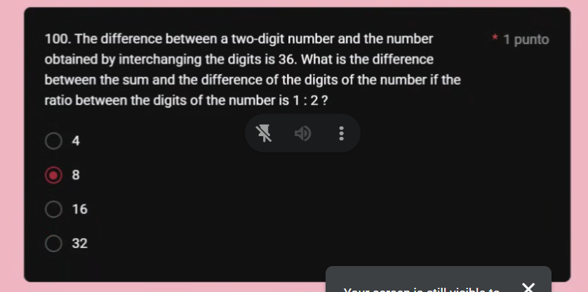
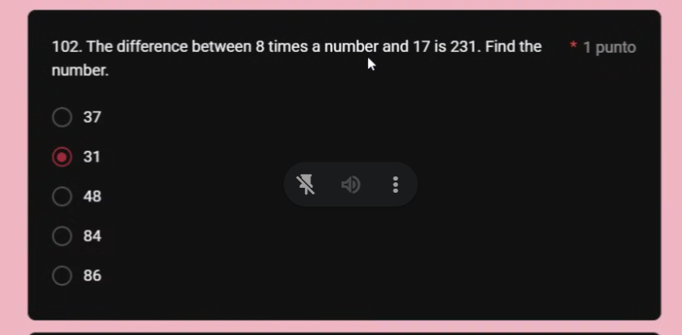
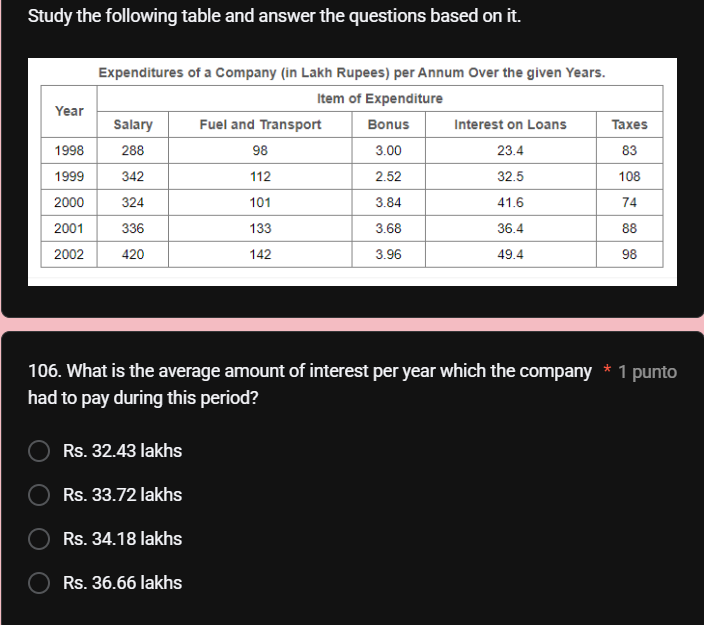

$F + S = 60$

F - 6 = 5(S-6)

F -6 + 6 = 5S - 30 + 6

F = 5S - 24

5S - 24 + S = 60

6S = 84

S = 14

M = S + 24

M + 2 = 2(S+2)

M = 2S + 4 - 2

M = 2S + 2

2S + 2  = S + 24

S = 22

3 (x + y + z) = 3 + 2/3

$3 \times (\mathbb{Z}^+)$

$3 \times (2n + 1 + (2(n+1) + 1) + 2(n+2) + 1) = 3 + 2/3$

3 (x+y+z) = 3 + 2z

y = z - 2

x = z - 4

3 (z-4 + z-2 + z) = 3 + 2z

3 (3z - 6) = 3 + 2z
9z - 18 = 3 + 2z

9z - 2z = 18 + 3
7z = 21

z = 3

3 * (-1+1+3) = 3 + 6
3(3)= 9

9=9

$x\geq 9$

xy = yx 

xy- yx = 36

x1 = 2y

x = 2y

x + y = S
x - y = D

3y = S

y = D

S - D = 3y - y
S - D = 2y

4, 8

48 = 84

48 - 84 = -36

y = 4
x= 8
|48 - 84| = |-36|

|S - D = 2y = 2 *4 = 8

y = 8
x= 4

84 - 48 = 36

S - D = 2y = 16

$W \leq 9$

$9days = 1$

2/3 

=.67

= .7

8x - 17 = 231
8x = 248

x = 

$p_1 = 5$

$p_2 = 6$

1

$p_3 = 10$

3

$p_4 = 19$

6

$p_5 = 35$

6

$p_6 = 60$

 3 x 5

If a poster, which is 3 inches wide and 5 inches long, is enlarged such that the ratio of the width to the length is maintained, how many inches long will it be if the new width is 9 inches?

11

25

15

13

27

$$p=\frac{\Sigma^n_{i=1} b_i}{\Sigma^n_{i=1} s_i}= \Sigma\frac{b_i}{s_i}$$

b_i = 3 + 2.52 + 3.84+3.68 +3.96

s_i = 288 + 342 + 324 + 336 + 420

b_i/s_i = p

